# StyleNest 👗

A responsive front-end e-commerce site for a women's fashion & accessories boutique — built with vanilla HTML, CSS, and JavaScript. StyleNest showcases a full shopping experience (browsing, cart, wishlist, checkout, and a mock auth flow) without any backend, using `localStorage` to simulate a real store.

## ✨ Features

- **Product browsing** — home, shop, categories, and accessories pages with filterable listings
- **Product details** — dedicated product page with imagery and info
- **Cart** — add/remove items, adjust quantities, promo codes, and shipping calculation (flat rate with a free-shipping threshold)
- **Wishlist** — save items for later
- **Checkout & orders** — checkout flow with an order confirmation page
- **Authentication (mock)** — login/signup with client-side validation; session stored in `localStorage` so the profile page can greet the signed-in user
- **User profile** — account details page
- **Contact page** — with form handling
- **Fully responsive design** — mobile-friendly navigation and layout

> ⚠️ **Note:** This is a front-end demo. There is no real backend, database, or payment processing — all data (cart, wishlist, user session, orders) is stored locally in the browser via `localStorage`.

## 🛠️ Tech Stack

- **HTML5** — semantic markup across all pages
- **CSS3** — custom stylesheets per page/section (`style.css`, `shop.css`, `auth.css`, `profile.css`, `accessories.css`)
- **JavaScript (Vanilla)** — modular scripts for each feature (`cart.js`, `wishlist.js`, `checkout.js`, `auth.js`, `product.js`, `shop.js`, `profile.js`, `contact.js`, `order.js`)
- **Google Fonts** — Fraunces, Inter, Space Mono

## 📁 Project Structure

```
StyleNest/
├── index.html            # Home page
├── shop.html              # Shop / product listing
├── categories.html        # Browse by occasion/category
├── accessories.html       # Accessories listing
├── product.html            # Product detail page
├── cart.html               # Shopping cart
├── wishlist.html           # Saved items
├── checkout.html           # Checkout flow
├── order.html               # Order confirmation
├── login.html / signup.html # Authentication
├── profile.html             # User account
├── about.html                # Brand story
├── contact.html              # Contact form
├── css/                      # Stylesheets
├── js/                       # JavaScript modules
└── images/                   # Product & category imagery
```

## 🚀 Getting Started

No build step or dependencies are required to run the site.

1. Clone the repository
   ```bash
   git clone https://anithasankar33-droid.github.io/StyleNest/
   cd StyleNest
   ```
2. Open `index.html` directly in your browser, **or** serve it locally for the best experience (some browsers restrict local file access for scripts):
   ```bash
   npx serve .
   # or
   python -m http.server 5500
   ```
3. Visit `http://localhost:5500` (or the port shown) in your browser.

## 🖼️ Pages Overview

| Page | Description |
|---|---|
| Home | Hero, featured collections, new arrivals |
| Shop | Full product catalog with filtering |
| Categories | Curated collections (e.g., Evening Wear, Casual Wear) |
| Accessories | Bags, jewelry, footwear, and beauty add-ons |
| Product | Individual product details |
| Cart | Review and manage selected items |
| Wishlist | Saved-for-later products |
| Checkout / Order | Complete purchase and view confirmation |
| Login / Signup | Mock authentication |
| Profile | Account information |
| About / Contact | Brand story and contact form |

## 📸 Screenshots

### 🏠 Home Page
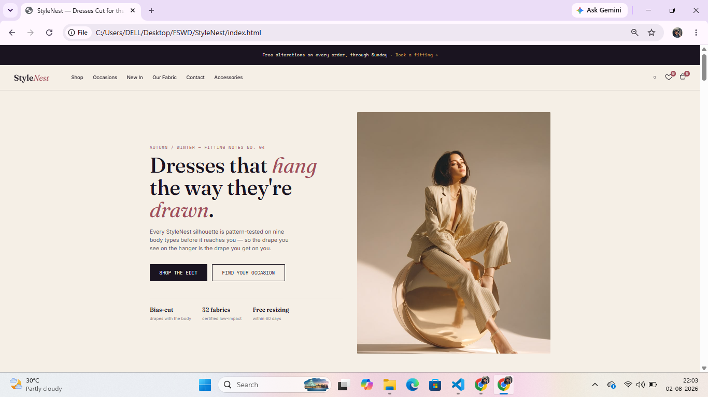 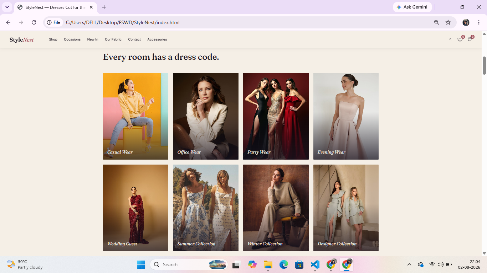
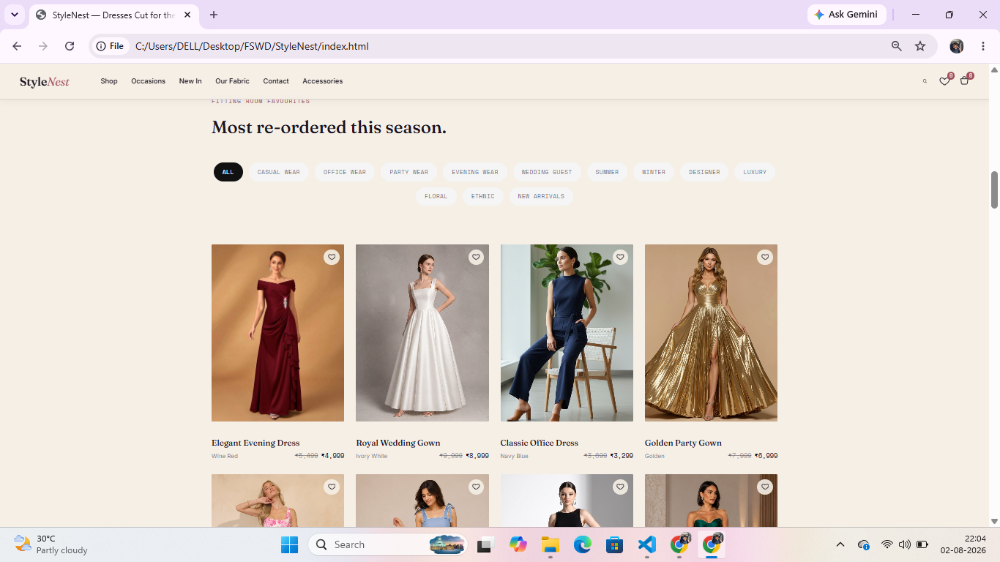

---
### 🛍️ Shop Page
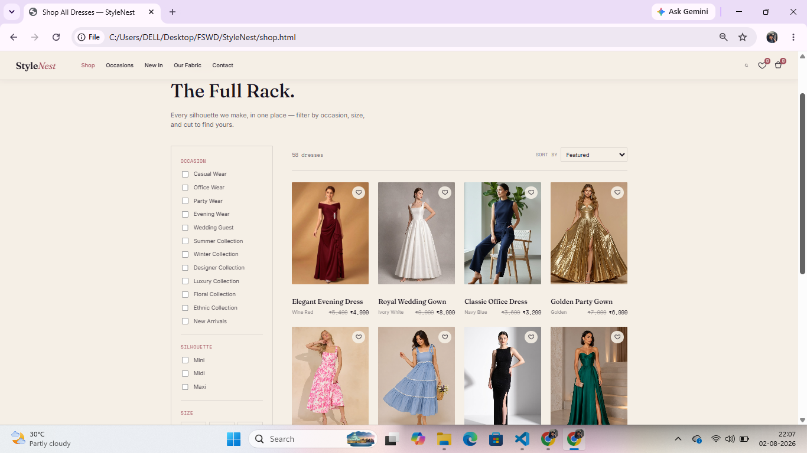 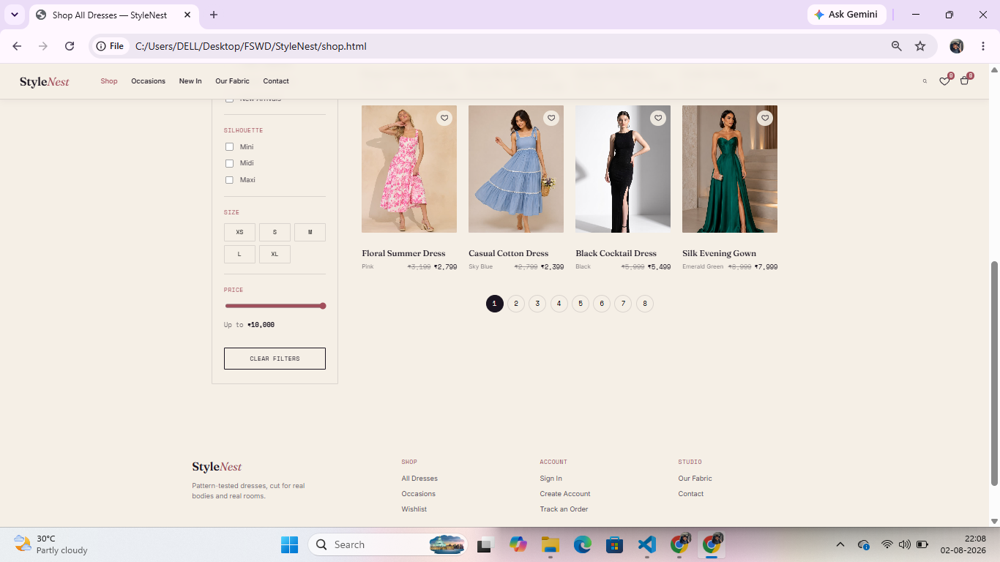

---
### 👗 Occasions Page
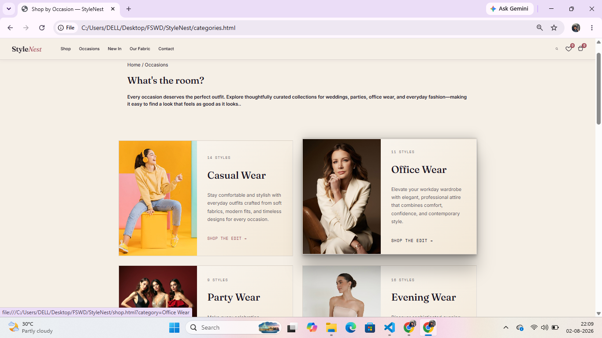

---
### 👜 Accessories
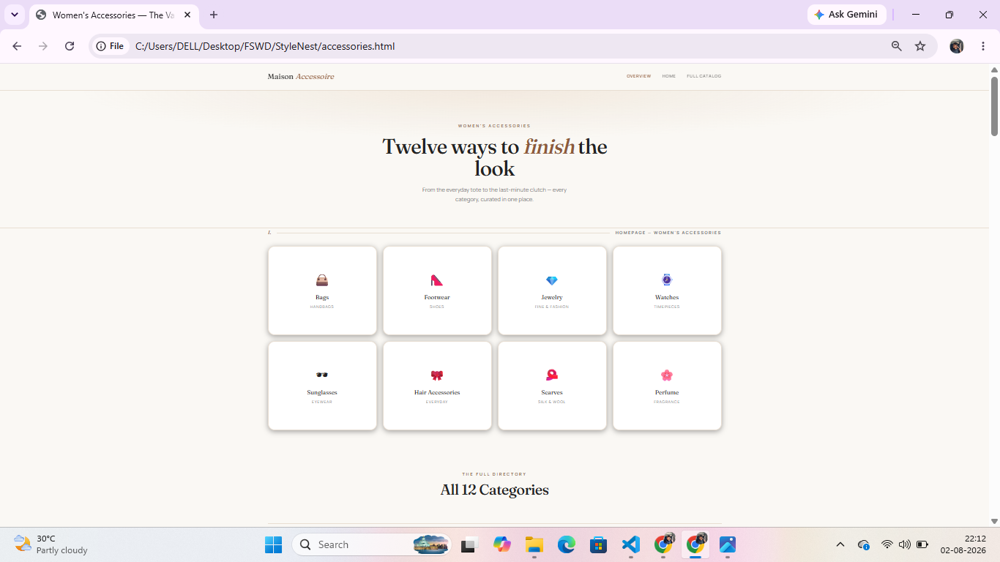  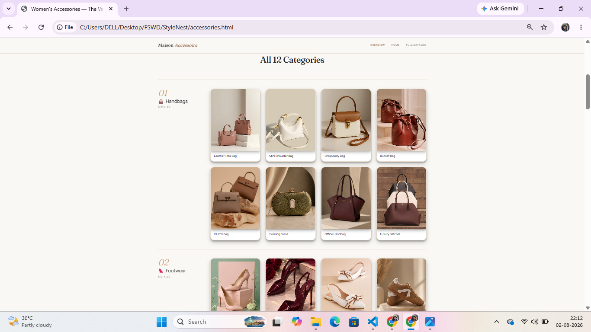 

---
### 🛒 Shopping Cart
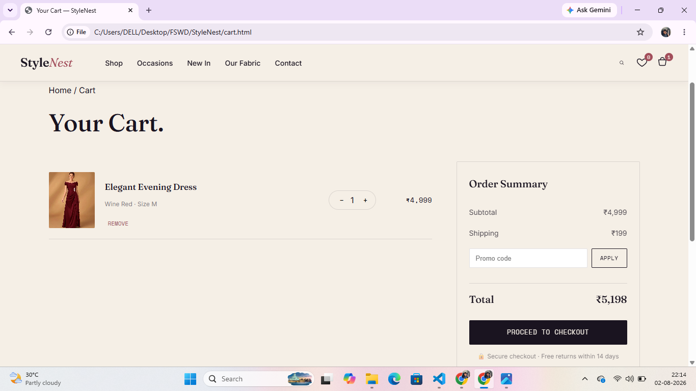 

---
### 🔐 Login
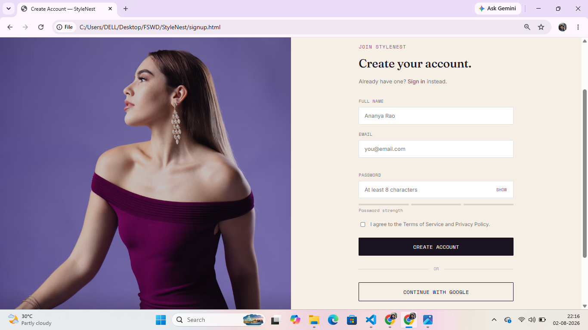  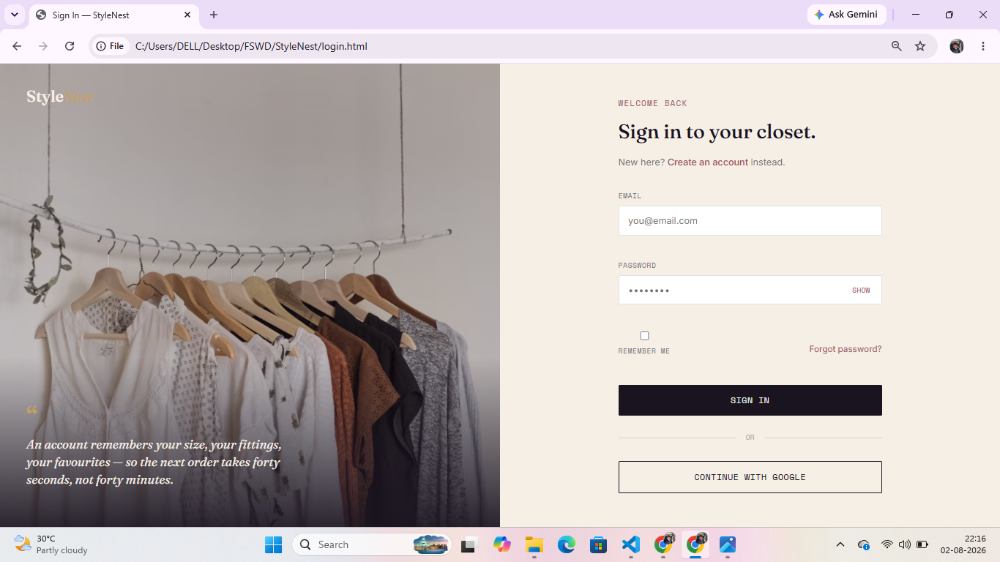

---
### 📞 Contact Page
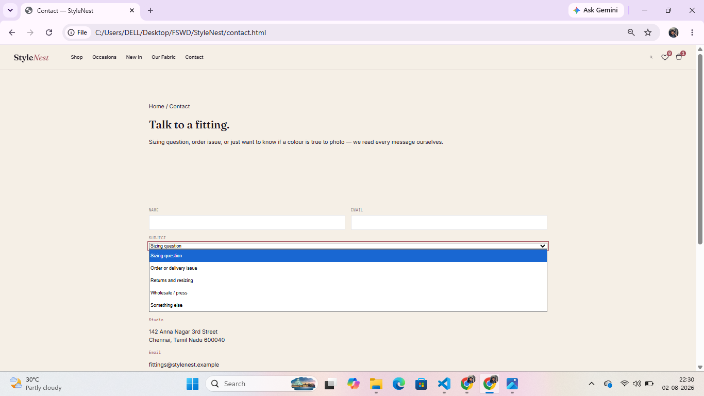

## 🗺️ Roadmap

- [ ] Connect to a real backend/API for products, auth, and orders
- [ ] Add real payment gateway integration
- [ ] Add product search and advanced filtering
- [ ] Migrate styling to a component-based framework (e.g., Tailwind CSS)
- [ ] Add automated tests

## 🤝 Contributing

Contributions, issues, and feature requests are welcome. Feel free to check the [issues page](../../issues) or open a pull request.

## 📄 License

This project is available for personal and educational use. Add a license of your choice (e.g., MIT) if you plan to distribute it.

## 👩‍💻 Author

**Anitha S.**

Aspiring Full Stack Developer passionate about building responsive, user-friendly web applications using HTML, CSS, JavaScript, React, Node.js, and modern web technologies.

- GitHub: https://github.com/anithasankar33-droid
